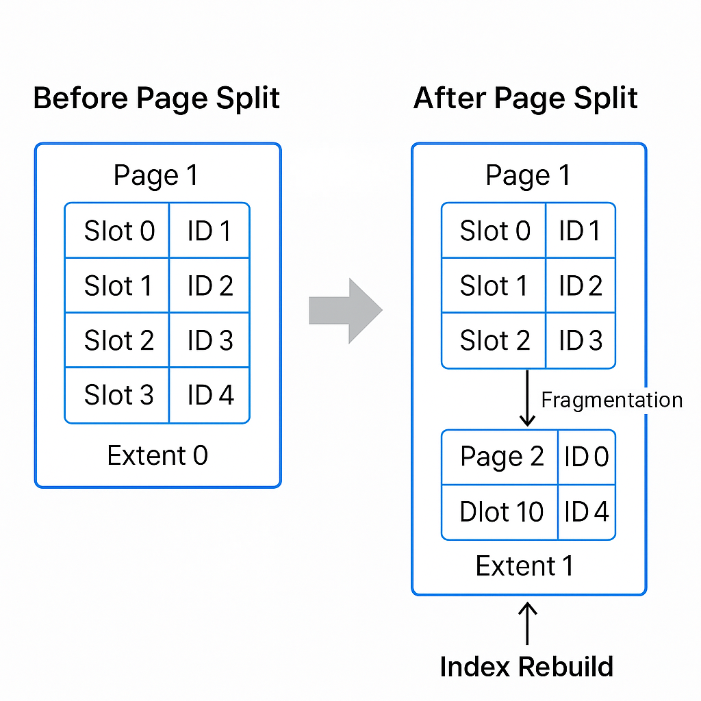

# SQL Server Page Split & Fragmentation Demo  
A complete, reproducible demo that shows **how a page split occurs**, which rows are moved, how fragmentation forms, and how an **index rebuild fixes it**.

This repo includes:

- ✔️ A full SQL script (`PageSplitDemo.sql`)
- ✔️ BEFORE → AFTER → AFTER REBUILD page-mapping snapshots
- ✔️ Row-level diff showing exactly which records moved during the split
- ✔️ A diagram illustrating the page split

---

## 📌 What This Demo Shows

This script demonstrates:

### **1. How a page split actually happens**
Updating a row with a larger payload forces SQL Server to:
- Split the 8KB page
- Move rows to a new page or extent
- Reassign slot positions
- Break physical contiguity → fragmentation

### **2. How to capture exact BEFORE/AFTER physical layout**
Using `sys.fn_PhysLocFormatter(%%physloc%%)` we capture:
- File ID  
- Page ID  
- Slot ID  
- Extent ID  

All stored into temp tables:
- `#BeforeSplit`
- `#AfterSplit`
- `#AfterRebuild`

### **3. Diff of moved records**
A simple join reveals which IDs changed:
- Page  
- Slot  
- Extent  

This is the *real* proof of a page split.

### **4. How index rebuild fixes fragmentation**
Rebuild recreates the index in a fresh physical order → pages become contiguous again.

---

## 📊 Diagram

This diagram shows the core concept:

 

---

## ▶️ How to Run the Demo

1. Run the script in SQL Server Management Studio or Azure SQL Managed Instance.
2. View the BEFORE snapshot.
3. Update row 10 to trigger a page split.
4. View the AFTER snapshot.
5. Rebuild the index.
6. View the FINAL snapshot.

---

## 📄 Files

### **PageSplitDemo.sql**
A fully commented, step-by-step script that:
- Creates a sample table  
- Inserts 100 rows  
- Captures page mappings  
- Forces a split  
- Captures after-split mappings  
- Rebuilds index  
- Captures final physical layout  
- Shows diffs at every stage  

This is a fully self-contained reproducible test.

---

## ⭐ Why This Matters

Most explanations of fragmentation are vague.

This demo shows:
- Exact physical changes
- Exact rows that moved
- Exact pages affected
- Exact impact of rebuild

This is fragmentation explained at the **storage engine level**.

---

## 🧑‍💻 Author
Pradeep — SQL Server performance, indexing, and internals practitioner.

---

## 📣 Contributions
PRs welcome for:
- More diagrams  
- Variations (fill factor, random distribution, large pages)  
- DBCC PAGE enhancements  

---

